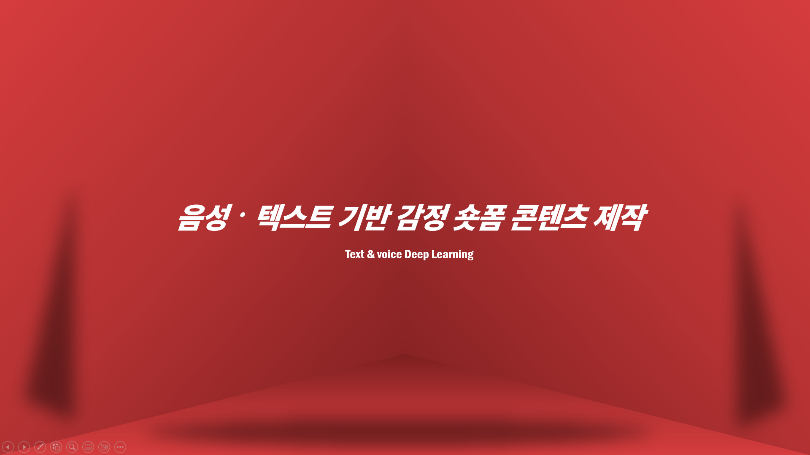
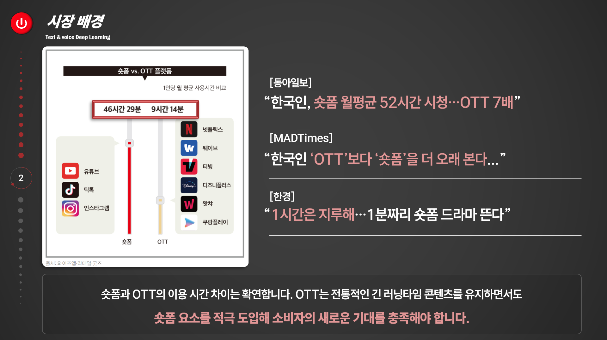
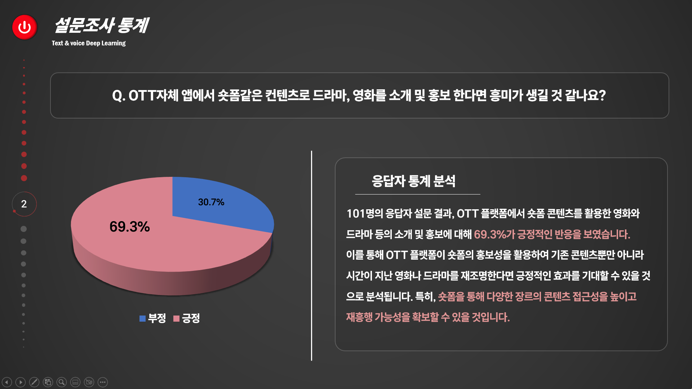
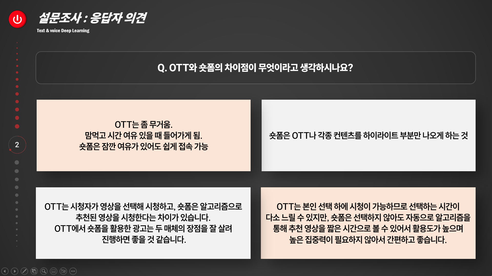
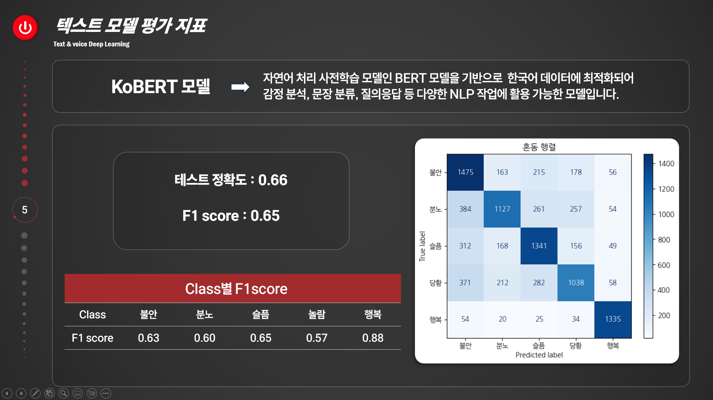
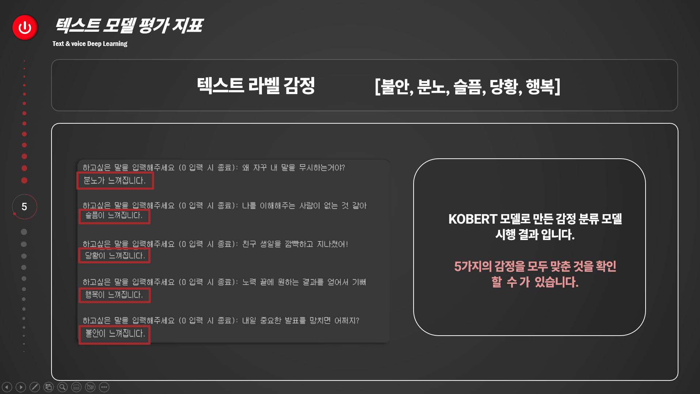

# 🤖 딥러닝 모델 개발 텍스트와 음성 감정분석 시스템

### 📅 **개발 기간**  
2024.10.28 ~ 2024.11.18

### 🌟 **프로젝트 소개**  
- **프로젝트 명:** 딥러닝 모델 개발 텍스트와 음성 감정분석 시스템
- **프로젝트 제작 인원:** 2명

- **주요 역할:**
  
1. 모델 성능 분석
KOBERT 모델을 활용하여 텍스트 감정 분석의 성능을 분석하고, 최적의 성능을 달성하기 위한 방법을 모색하였습니다.

2. 모델 설계 및 성능 최적화
텍스트 감정 분석 모델을 설계하고, 다양한 파라미터를 조정하여 성능을 최적화하였습니다.

3. PPT 제작 및 설문조사 담당
프로젝트 결과를 효과적으로 전달하기 위해 PPT를 제작하고, 숏폼과 OTT관련 설문조사를 진행하여 사용자 피드백을 수집하였습니다.

- **분석 목표:**  
  - 텍스트와 음성 감정분석을 통한 숏츠 영상 제작  
  - 한국어 감정 분석 예측 성능 향상

### 🛠 **주요 성과**  
- **텍스트 감정 분석 모델(KOBERT) 모델 성능 65%** 달성
- 설문조사 결과 OTT 시장의 숏폼 콘텐츠 도입 시 긍정적인 결과 도출

---
### 🌟 프로젝트 이미지
- 아래는 프로젝트 발표 자료에서 사용된 대표 슬라이드입니다.
<table align="center">
  <tr>
    <td align="center">
      
      
딥러닝 메인 슬라이드

    </td>
    <td align="center">
      
      
딥러닝 분석 

    </td>
    <td align="center">
      
      
딥러닝 분석 

    </td>
    <td align="center">
      
      
딥러닝 분석 

    </td>
    <td align="center">
      
      
딥러닝 모델 성능

    </td>
    <td align="center">
      
      
딥러닝 모델 성능

    </td>
  </tr>
</table>

---

### 📹 음성, 감정 분석 결과 영상 및 홈페이지 구현영상

- **음성, 감정 분석 결과 영상: 분노 모음집_베테랑**  
  [분노 모음집_베테랑.mp4](https://github.com/user-attachments/assets/e1e65a42-562e-40c1-9fbd-c9d177f22308)

- **홈페이지 구현 영상**  
  

---

### 🔗 프로젝트 문서
- 전체 발표 슬라이드 PDF: [텍스트, 음성 감정 딥러닝 피피티.PDF](./텍스트%2C%20음성%20감정%20딥러닝%20피피티.pdf)
---

### 🛠 주요 기술 및 도구
- **데이터 수집:** [MOA]자체 설문조사, AI허브  
- **데이터 분석:** Python, Jupyter, Excel
- **모델 개발:** KOBERT
